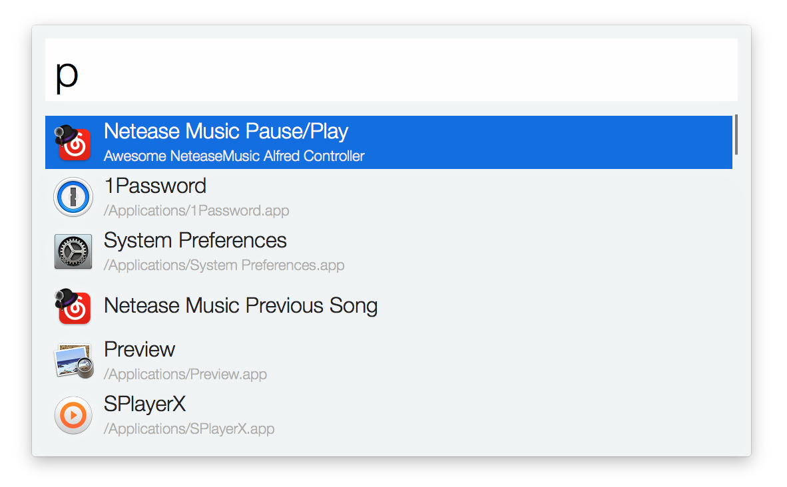

# 网易音乐 Alfred 控制器

此扩展需要开启网易云音乐全局快捷键（这使云音乐在后台时也可以响应），点击恢复默认后既可立刻使用此扩展。

### 下载

点击[**这里**](https://github.com/li-xinyang/AW_NeteaseAlfredController/blob/master/NeteaseMusicController.alfredworkflow?raw=trueg)下载，下载后双击既可自动导入（你需要拥有 Alfred Powerpack，免费版并不支持工作流扩展）。

### 支持功能

|关键字|功能描述|
|------|--------|
|`nm` or `nmp`|暂停与播放|
|`nmnx` or `nmnext`|下一首列表中的歌曲|
|`nmpr` or `nmprevious`|上一首列表中的歌曲|
|`nmlv` or `nmlove`|为当前歌曲加心|

**参考资源**

[Mac OS X 下功能按键在 AppleScript 下的编号 (Key Codes for Function and Special Keys in Applescript)](http://macbiblioblog.blogspot.sg/2014/12/key-codes-for-function-and-special-keys.html)
