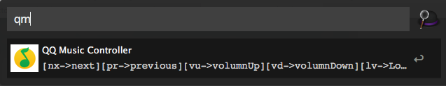
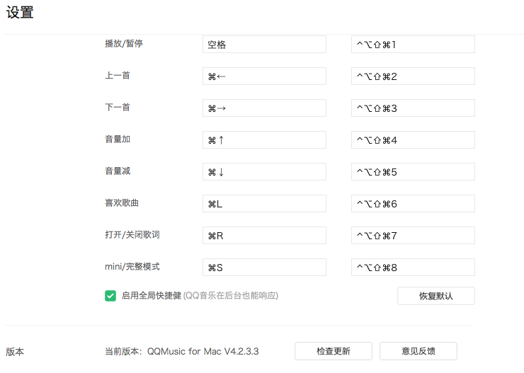

# QQ音乐 Alfred 控制器

Inspired By [网易Alfred控制器](https://github.com/li-xinyang/AW_NeteaseAlfredController)

此扩展需要开启QQ音乐全局快捷键（这使云音乐在后台时也可以响应）

**为避免按键冲突请将全局快捷键设置为下图所示**

此版本兼容 Alfred 2 和 Alfred 3

### 下载

点击[**这里**](https://github.com/turygo/QQMusicAlfredController/blob/master/QQMusicController.alfredworkflow?raw=true)下载，下载后双击既可自动导入（你需要拥有 Alfred Powerpack，免费版并不支持工作流扩展）。

### 支持功能

|关键字|功能描述|
|------|--------|
|`qm` or `qm p`|暂停与播放|
|`qm nx` or `qm next`|下一首列表中的歌曲|
|`qm pr` or `qm previous`|上一首列表中的歌曲|
|`qm lv` or `qm love`|为当前歌曲加心|
|`qm vu` or `qm volumup`|增加音量|
|`qm vd` or `qm volumdown`|减小音量|

**参考资源**

[Mac OS X 下功能按键在 AppleScript 下的编号 (Key Codes for Function and Special Keys in Applescript)](http://macbiblioblog.blogspot.sg/2014/12/key-codes-for-function-and-special-keys.html)
